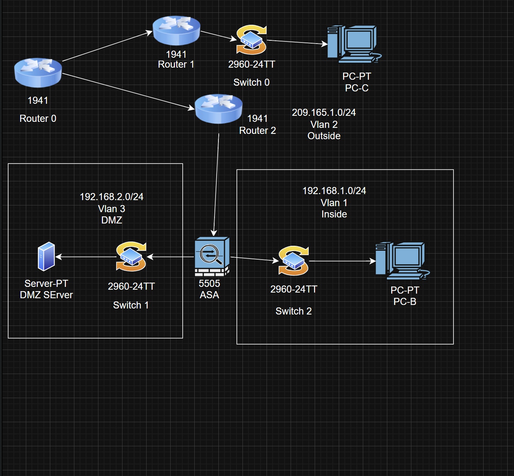

# Network Analysis Documentation

## 0. Network Diagram

## 1. Network Devices

### Routers
- **Router 0** - Cisco 1941
- **Router 1** - Cisco 1941
- **Router 2** - Cisco 1941

### Switches
- **Switch 0** - Cisco 2960-24TT
- **Switch 1** - Cisco 2960-24TT (DMZ)
- **Switch 2** - Cisco 2960-24TT (Inside)

### Firewall
- **Cisco ASA 5505**

### End Devices
- **PC-C** - Outside network
- **PC-B** - Inside network
- **DMZ Server**

---

## 2. Configuration Details

### Network Segmentation

The network is divided into three separate zones for security:

#### Outside Network (Vlan 2)
- **Network:** 209.165.1.0/24
- **Purpose:** Public-facing network

#### Inside Network (Vlan 1)
- **Network:** 192.168.1.0/24
- **Purpose:** Internal user network

#### DMZ (Vlan 3)
- **Network:** 192.168.2.0/24
- **Purpose:** Protected zone for servers

### Security Setup
- ASA 5505 firewall sits between all three zones
- Firewall controls traffic flow between Inside, DMZ, and Outside
- Three routers create redundant paths and network distribution

---

## 3. Demarc Point

The **demarcation point** is located at **Router 1**, which connects to the outside network (209.165.1.0/24).

This is where your network ends and the ISP's network begins - essentially the handoff point between your equipment and the internet service provider.

---

## 4. Operating Systems

### Network Device OS
- **Routers:** Cisco IOS (version 15.x)
- **Switches:** Cisco IOS (version 15.x or 12.2)
- **ASA Firewall:** Cisco ASA OS (version 9.x)

### Workstation OS (Examples)
- **PC-C:** Windows 10
- **PC-B:** Windows 10
- **DMZ Server:** Windows Server 2019 or Linux

---

## 5. Protocols

### Basic Network Protocols
- **IP** - Main protocol for addressing and routing traffic
- **TCP/UDP** - Transport layer for reliable/fast data delivery
- **ICMP** - Used for ping and network diagnostics
- **ARP** - Maps IP addresses to physical MAC addresses
- **Ethernet** - Layer 2 protocol for local network communication

### Security Protocols
- **NAT/PAT** - Translates private IPs to public IPs
- **ACLs** - Access control rules on firewall
- **SSH** - Secure remote management
- **IPsec** - Encrypted VPN tunnels (if configured)

### Application Protocols
- **HTTP/HTTPS** - Web traffic
- **DNS** - Translates domain names to IP addresses
- **DHCP** - Automatic IP address assignment
- **SMTP/POP3** - Email (if mail server in DMZ)

---

## 6. Interface Addresses

### Outside Network
- **Network:** 209.165.1.0/24
- **Subnet Mask:** 255.255.255.0
- **Usable IPs:** 209.165.1.1 - 209.165.1.254

### Inside Network
- **Network:** 192.168.1.0/24
- **Subnet Mask:** 255.255.255.0
- **Usable IPs:** 192.168.1.1 - 192.168.1.254

### DMZ Network
- **Network:** 192.168.2.0/24
- **Subnet Mask:** 255.255.255.0
- **Usable IPs:** 192.168.2.1 - 192.168.2.254

### Router Interconnections
- Point-to-point links between Router 0, Router 1, and Router 2

---

## 7. Services

### Security Services
- **Firewall Protection** - Stateful packet inspection
- **NAT/PAT** - IP address translation
- **Traffic Filtering** - Between network zones

### Network Services
- **Layer 2 Switching** - Connecting devices on same network
- **Layer 3 Routing** - Moving traffic between different networks
- **Inter-VLAN Routing** - Communication between Inside, DMZ, Outside

### Server Services (DMZ)
- **Web Server** - HTTP/HTTPS
- **Email Server** - Potential
- **FTP Server** - Potential
- **Public-Facing Applications**

### Management Services
- **SSH** - Secure command-line access to devices
- **HTTPS** - Web-based management interface
- **SNMP** - Network monitoring (potential)

### Supporting Services
- **DHCP** - Automatic IP address assignment for PCs
- **DNS** - Domain name resolution